# Lightmotron

A MicroPython-based lighting controller for plastic model kits, running on an ESP32. Uses NeoPixel LED strips to produce dynamic lighting effects, and exposes a web interface for control over WiFi.

## Liscence

You are welcome to use this project in products, research, kits, and services.
Selling the software itself, or minor variations of it, as a standalone product is against the spirit of the project.

```
This software is licensed under GPLv3 with the following additional permission:
You may sell products or services that include this software, provided the software is not sold independently.
Distribution of the software itself, except as part of a larger product or service, is not permitted.
```

## Features

* NeoPixel LED strip control for model lighting effects
* MAX7219 4-module scrolling LED matrix display
* Web server for browser-based control
* WiFi connectivity

## Hardware

### Microcontroller
* YD-ESP32-S3 board (ESP32-S3-WROOM-1 N16R8 module — 16MB flash, 8MB octal PSRAM)

### Lighting
* NeoPixel LED strip (default GPIO 4; configurable via System Settings)

### Audio
* Up to 3× WWZMDiB YX5200 MP3 player modules (DFPlayer-compatible, serial UART)
* 1× PAM8403 stereo amplifier module (analog volume via onboard pot)
* 1–3× 3W 8Ω mini speakers
* Passive mix network: one 1kΩ resistor per player on DAC_R → PAM8403 input
* 1kΩ resistor on each ESP32-S3 TX → YX5200 RX line

## Setup

This repo uses a git submodule for shared MicroPython libraries. After cloning, run:

```bash
git submodule init
git submodule update
```

Code is parsed by MicroPython on-device, so use MicroPython-safe Python syntax in runtime files (for example, avoid PEP 604 union annotations like `str | None`).

## First Boot — WiFi Setup

On first boot (or whenever WiFi credentials are missing or fail to connect), the device starts a **captive portal** access point:

1. Look for a WiFi network called **`lightmotron-setup`** on your phone or laptop and connect to it.
2. Your device should automatically open the portal page. If not, navigate to `http://192.168.4.1/`.
3. The page shows a list of nearby WiFi networks sorted by signal strength. Select yours, enter the password, then tap **Save & Connect**. If your network isn't listed, choose **Other** to enter the SSID manually.
4. The device reboots and joins your network. You can then access it at `http://lightmotron.local/` (or `http://<hostname>.local/` if you have set a custom hostname).

SSID matching is case-insensitive, so credentials stored with different capitalisation will still connect.

Credentials are stored persistently, so this only needs to be done once. To change them later use the **System Settings** card on the Setup page.

## Uploading to the Device

```powershell
.\upload.ps1
```

`upload.ps1` now attempts to quiet the runtime (stops the web server when possible)
before transfer, uses mpremote resume mode to avoid upload-time soft resets, and retries transient transport/raw-REPL failures automatically.
It also always recopies critical runtime files (`boot.py`, `main.py`, `lib/audio.py`, `lib/sounds.py`) even during incremental uploads, to self-heal from stale or partial files left by interrupted transfers.
The upload summary distinguishes true hash-detected changes from these mandatory refresh files.

To hard reset the device after uploading:

```powershell
python tools\reset_device.py COM3
```

For browser-install deployment images (`deployment/lightmotron.bin`), build with `tools/build_deployment.py`. On ESP32-S3 N16 boards the default build now uses a full remainder-of-flash LittleFS image (14336 KB from `0x200000` to end of 16MB flash) so the filesystem mounts correctly on first boot.

## Web Interface

Once the device is running and connected to WiFi, open your browser and navigate to the device's IP address (e.g., `http://192.168.1.100/` or use the hostname `http://lightmotron.local/` if mDNS is available). (These screen shots are messed up.  I'll fix them at some point.)

At boot, routes are registered before the HTTP server thread starts so `/` consistently resolves to the dynamic Home page rather than transiently falling back to `www/index.html`.

### Home Page
Control animation playback and trigger scenes. Start/stop lighting animations, switch between configured scenes, and play sounds from the audio modules.
The Active Scenes list includes both ongoing scenes and immediate scenes while they are currently running.
When stopping animation, the runtime now waits for any in-flight frame to finish before applying the stop clear, so LEDs reliably settle to black/off.
The Home animation controls also now update to the stopped button state immediately when Stop is pressed.
Home now uses a single Soundscapes section for audio controls; the master volume slider and Stop All Sounds control are shown there.
The Immediate scenes section is only shown when at least one scene is configured as immediate.

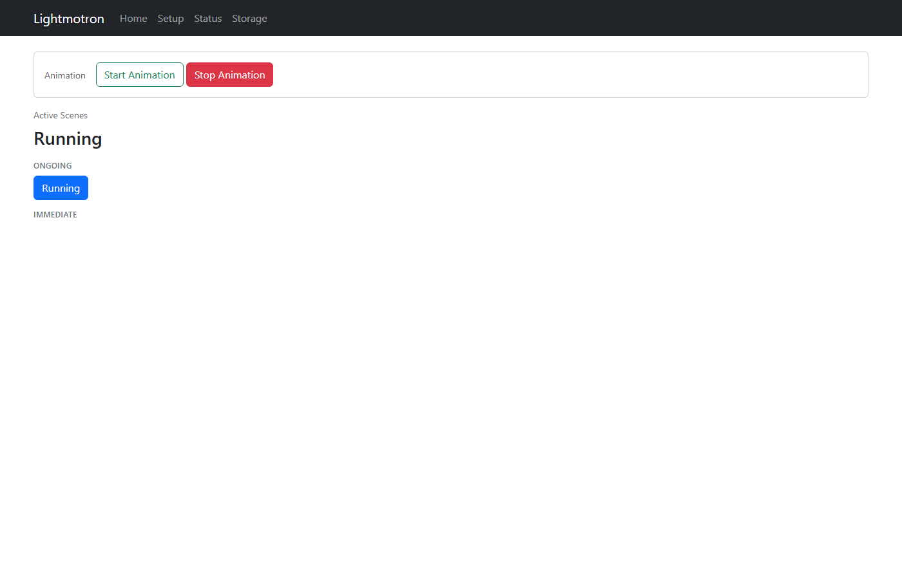

### Setup Page
Configure all lighting settings and system configuration in one place. Each section opens a dialog to manage that category.
Cards use a consistent responsive grid layout (up to four cards per row on wide screens), and the Named Ranges summary area scrolls to prevent that card from growing excessively tall.

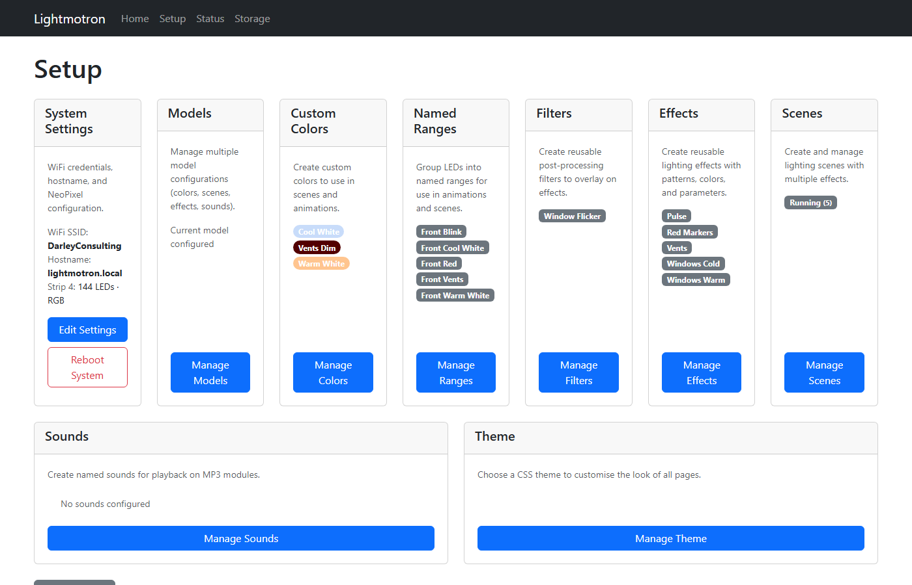

#### System Settings
Configure WiFi credentials, mDNS hostname, NeoPixel strip settings, and audio player UART pins. Changes take effect on the next reboot.

**IP Address Announcement**: When the device boots with audio players configured and its IP address has changed since the last boot, it will automatically announce the new IP address. This uses randomly-selected voice 8 or 9, playing the digits of each octet with 2-second pauses between them, then repeating once after 15 seconds. Click **Mark Current IP as Announced** to store the current IP so it won't be announced again unless the IP changes.

#### Models
Manage multiple named "Models" — each Model is a self-contained collection of lighting configuration (scenes, effects, filters, named ranges, custom colors, and optional per-model sounds). Use the Models card on the Setup page to create, rename, delete, or switch the active model. The device stores the active model in persistent settings; older single-model installations are automatically migrated into a default model named "Model".

#### Custom Colors
Define and name your own colors to reuse across effects and scenes.

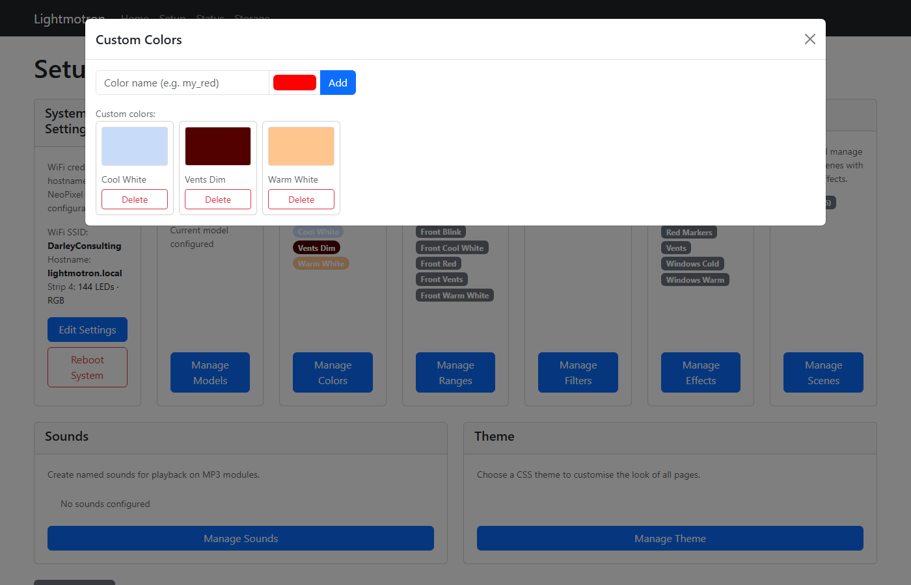
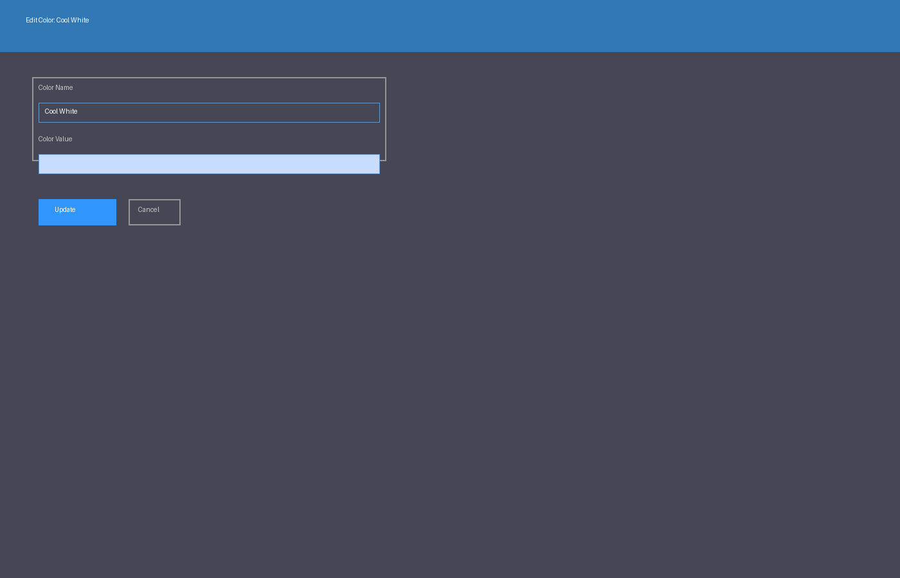

#### Named Ranges
Group LED indices and give them meaningful names (e.g. "Nacelle", "Hull"). Use the LED picker to visually select individual LEDs, or include another named range to build composite groups. Range buttons show the resolved LED summary, and included subranges are listed separately in the editor where they can be removed.
In the LED picker, button highlights show only LEDs directly selected in the current range; LEDs inherited through included subranges are not highlighted as direct selections.
When you add an included subrange from the dropdown, the editor updates immediately by clearing the selector and adding the subrange chip without waiting for a full modal refresh.
The Setup page Named Ranges summary uses the same compact format on initial load and after modal-driven refreshes.

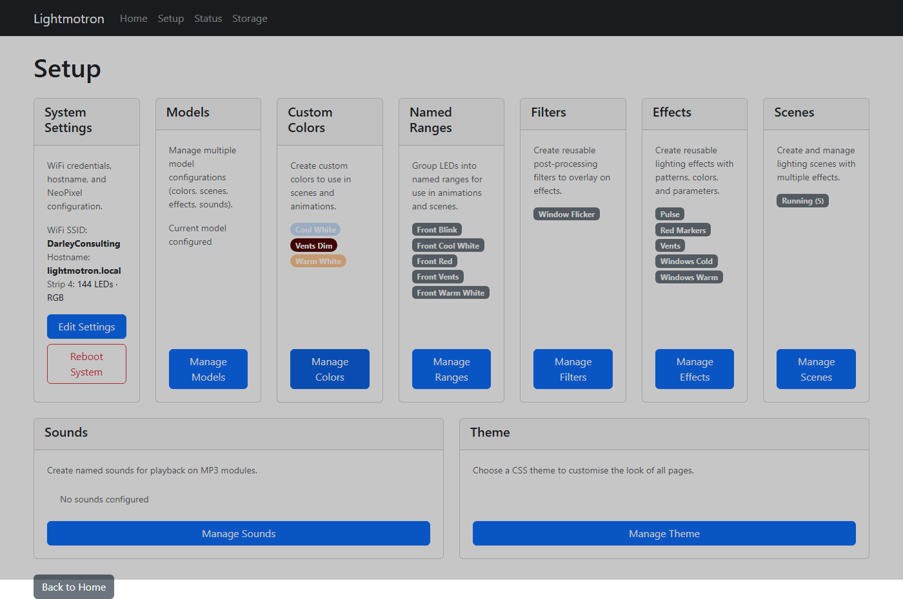
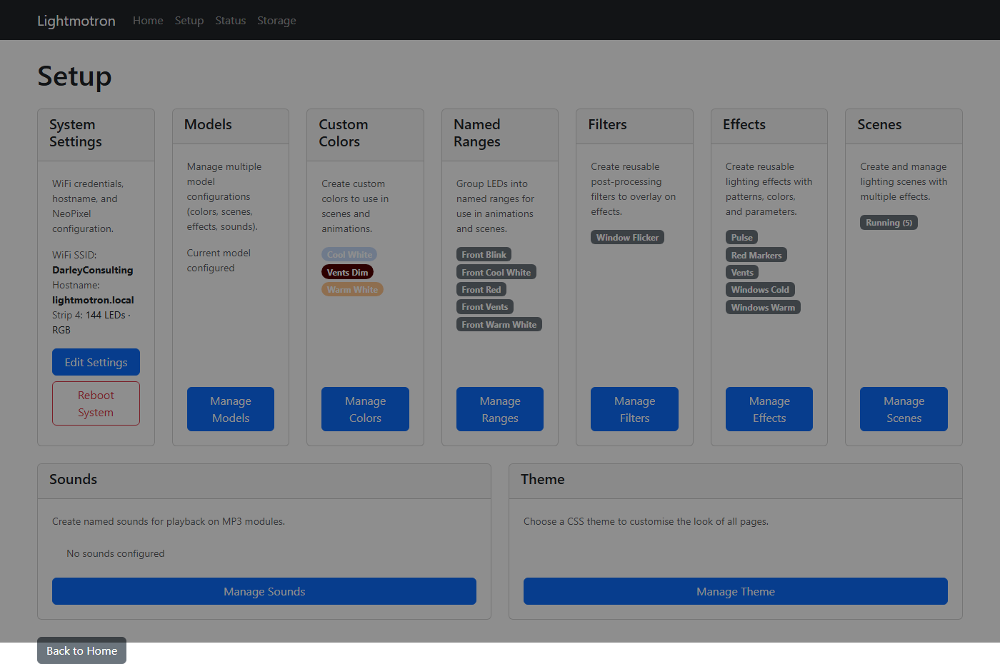

#### Filters
Create reusable post-processing filters (sparkle, flicker, etc.) that can be applied to any effect.

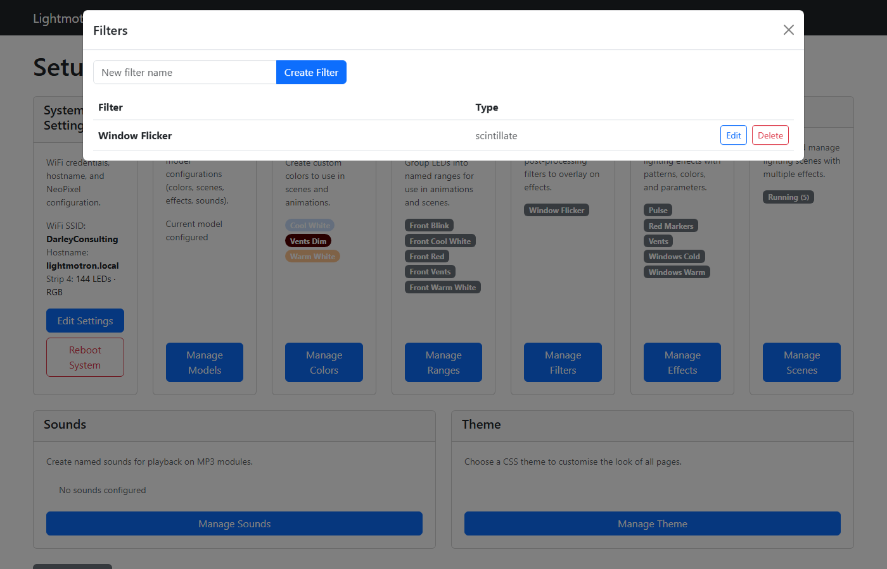
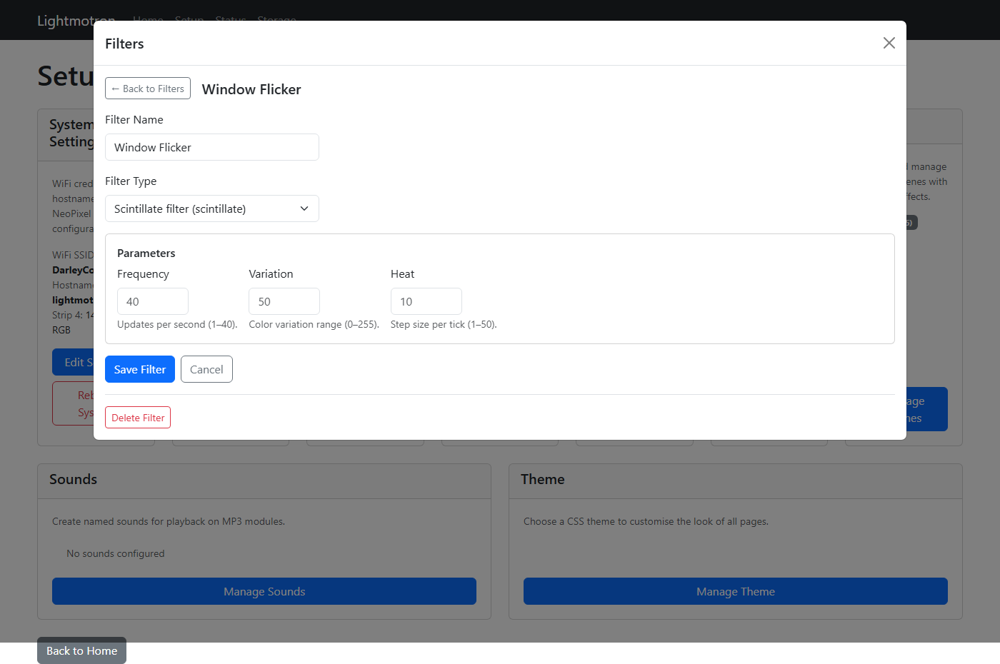

#### Effects
Create reusable lighting animations with a pattern, colors, and optional filters.

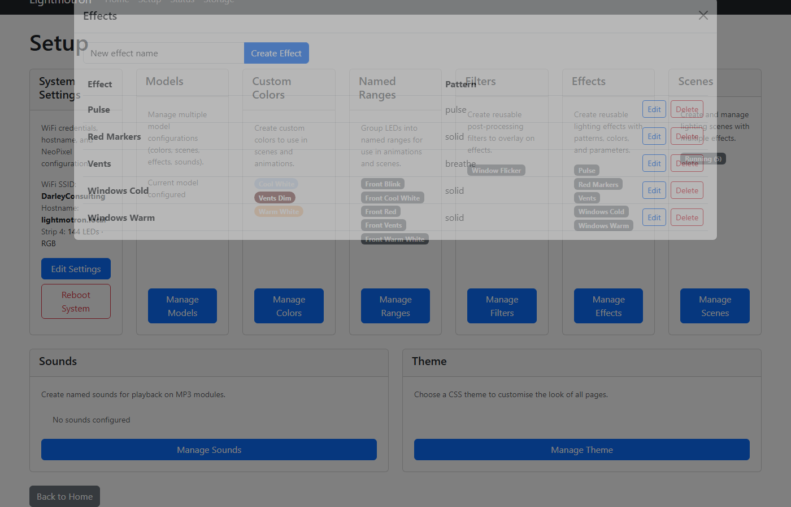
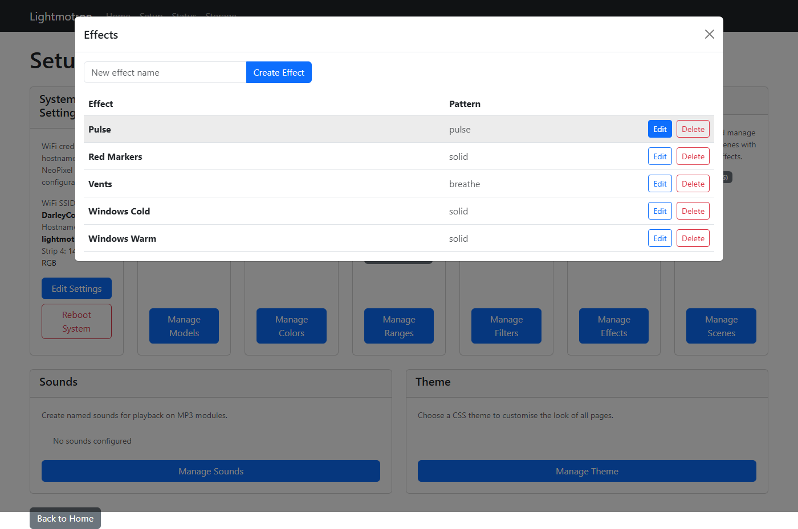

#### Scenes
Combine effects into complete lighting scenarios. Each scene contains one or more jobs assigning effects to LED targets.
Scenes can also define scene-level behavior: kill other scenes on start, play a trigger sound, stop selected sounds on start, and stop selected sounds when the scene ends.

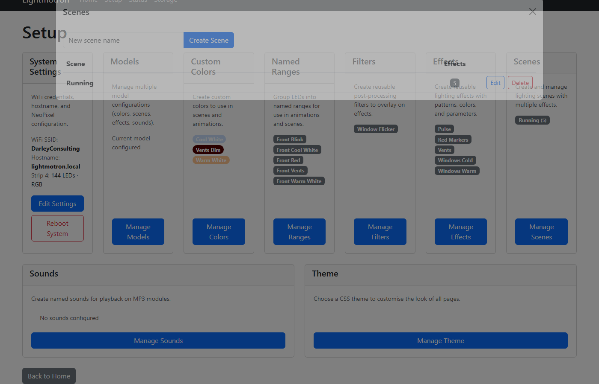

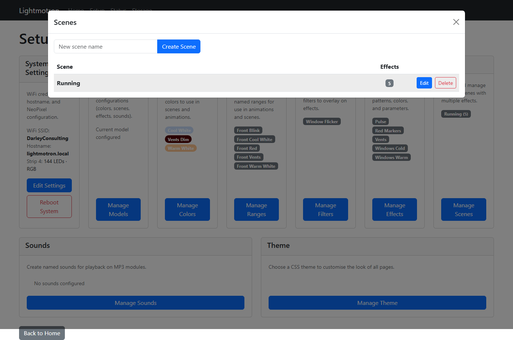

#### Sounds
Create named sounds that map to MP3 file numbers on the SD cards in your audio modules. Associate titles with files, choose whether they appear on Home, and mark sounds as high quality for preferential playback on high-quality modules.
Home single-sound Stop now verifies module state and retries the stop command when needed, reducing cases where UI switches to Play but hardware keeps playing.
Playback-end detection now requires multiple consecutive stopped status reads from the module to reduce false "ended" transitions while audio is still audible.

#### Soundscapes
Create ordered groups of sound entries. Entries are editable in Setup after creation (sound, repeat enabled, repeat count). Repeat behavior is: with Repeat disabled it plays once, with Repeat enabled and count `0` it repeats forever, and with Repeat enabled and a positive count it repeats that many additional times.
Soundscape progression is tied to the active soundscape entry finishing; unrelated sound end events do not advance or retrigger the soundscape.
Home status polling also reconciles active soundscape state with current playback, so controls recover if a playback-end transition is missed.

#### Theme
Choose a CSS theme to customise the look of the interface.

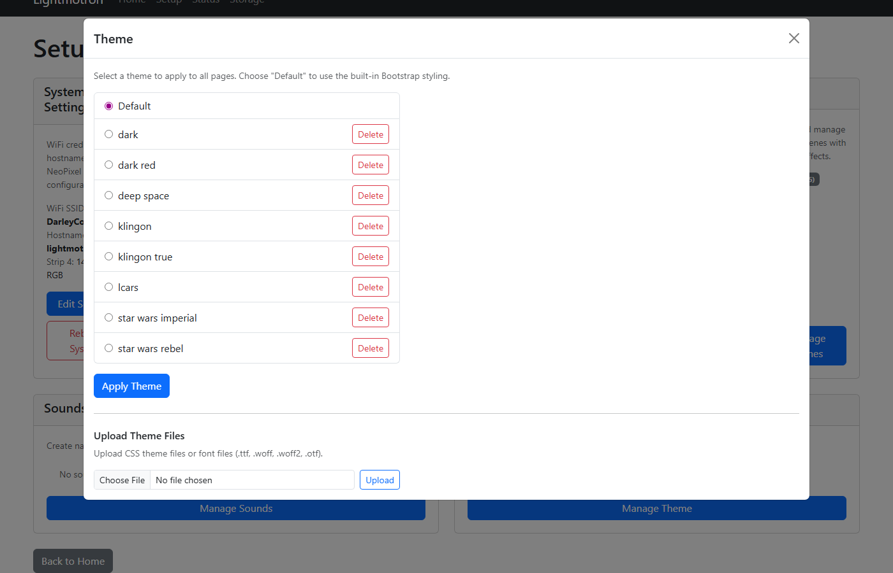

#### Updates
Use Setup -> Updates for OTA code updates directly from GitHub.

Workflow:
1. Choose the repository owner/name (defaults to `PeterDarley/lightmotron`) and save.
2. Run **Check Now** to compare local files with the selected repository.
3. Review the changed file list (added / modified).
4. Run **Apply Updates** to pull and write changed files.

GitHub is the canonical source — any file on the device that differs from the repo will be overwritten. Files on the device that are not in the repo are left untouched.

### Status Page
Monitor system health and performance. View memory usage, storage space, networking details (hostname, IP, connection state, SSID), animation state, and configured audio modules with current responsiveness. Download/restore all configuration as JSON.
Status cards use the same responsive card grid as Setup (up to four cards per row on wide screens), and status tables are rendered with theme-friendly styling so they blend with the active CSS theme.
Restore now uses a `.json` file upload flow (select file -> review -> confirm) instead of pasting raw JSON into a textarea.

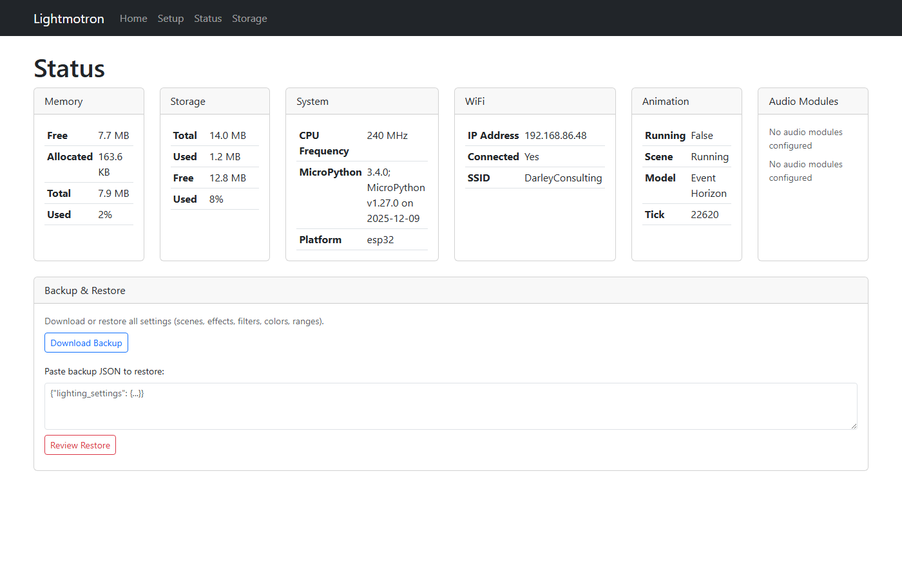

### Storage Page
View and export the raw JSON configuration of all settings. The WiFi password is shown as `***` for security.

The **backup download** (available from the Status page) omits WiFi credentials entirely so that restoring a backup on a different device does not overwrite its network configuration.

## Lighting System

The lighting system allows you to create custom **scenes** that control LED colors and animations.

### Key Concepts

* **Scene** — A named configuration that controls LED behavior. Scenes can run continuously or be triggered on-demand.
* **Effect** — A reusable LED animation (e.g., "pulse", "wave", "breathe"). Each effect has parameters you can customize.
* **Filter** — Optional post-processing applied to effects (e.g., "sparkle", "flicker"). Multiple filters can be stacked.
* **Named Range** — A group of LEDs that you label (e.g., "engine lights"). Useful for targeting groups instead of individual indices.
* **Custom Color** — Save your own colors with custom names to reuse across scenes.

### Using the Web Interface

The **Setup** page provides a visual editor for all lighting configuration:

1. **Custom Colors** — Define and name your own colors once, reuse them everywhere
2. **Named Ranges** — Group LEDs and give them meaningful names (e.g., "Nacelle", "Hull")
3. **Effects** — Create reusable animations with specific patterns, colors, and behavior
4. **Filters** — Add optional visual tweaks to effects (sparkle, flicker, etc.)
5. **Scenes** — Combine effects into complete lighting scenes; assign effects to LED groups

Once configured, use the **Home** page to:
* Start/stop animation playback
* View active scenes
* Trigger immediate scene changes

### Effects Overview

| Effect | What It Does | Good For |
|---|---|---|
| **Solid** | Single color, no animation | Steady lights, engine glow |
| **Blink** | Symmetric on/off flashing | Warning lights, indicators |
| **Pulse** | Asymmetric flashing with separate on-time and period | Pulsing beacons |
| **Fade In** | Smooth color transition | Startup sequences, transitions |
| **Breathe** | Smooth up-and-down oscillation | Life-like breathing, organic feel |
| **Wave** | Moving light across LEDs | Scanning beams, comet sweep |
| **Cylon** | Wave that bounces back and forth | Iconic bouncing scan effect |
| **Phaser Strip** | Two waves converge from opposite ends | Sci-fi phaser effects |

Use `Blink` for equal on/off timing. Use `Pulse` when you need a short flash with a longer gap, such as one tick on every second.

### Filters Overview

Filters add visual flavor to effects after they render:

| Filter | What It Does | Good For |
|---|---|---|
| **Scintillate** | Independent sparkling per LED | Twinkling stars, fireworks |
| **Sizzle** | Synchronized group flicker | Electrical arcing, unified flicker |
| **Brightness** | Multiplies each RGB channel by a constant, clamped to 0-255 | Global dimming/boost, quick intensity matching |

### Advanced: Direct Configuration

For advanced users, lighting can be configured directly via the persistent storage JSON. See [docs/internals.md](docs/internals.md) for the complete technical reference including all effect parameters, color names, and target specifications.


---

## Documentation

* [**Theming Guide**](docs/theming.md) — CSS theming system, custom classes, sound effects
* [**Lighting Internals**](docs/internals.md) — Technical reference for patterns, filters, and configuration
* [**NeoPixel Wiring**](docs/neopixel-wiring.md) — LED strip pinout and connection details
* [**Storage Format**](docs/settings_template.py) — Reference for the persistent storage JSON structure