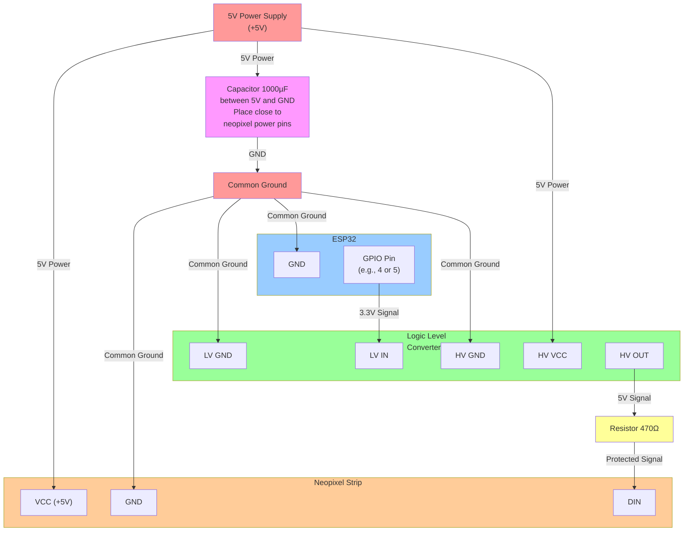

# Neopixel Strip Wiring Diagram

## Wiring Setup

This diagram shows how to wire a neopixel strip to an ESP32 using a 5V power supply with a capacitor, resistor, and logic level converter.

## Key Points

- **All grounds must be connected together** (common ground)
- The **capacitor** (1000µF recommended) is placed close to the neopixel strip's power pins for voltage stability
- The **resistor** (470Ω recommended) sits between the logic level converter output and the neopixel DIN to protect against signal issues
- The **logic level converter** bridges the 3.3V ESP32 signal to the 5V neopixel requirements

## Component Details

| Component | Purpose |
|-----------|---------|
| Capacitor | Reduces voltage spikes and provides stable power |
| Resistor | Protects against signal reflections |
| Logic Level Converter | Converts 3.3V ESP32 signal to 5V neopixel signal |

Make sure to use a 5V power supply with sufficient amperage for your LED count (roughly 60mA per LED at full brightness).
